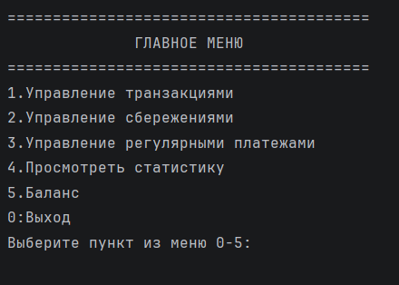
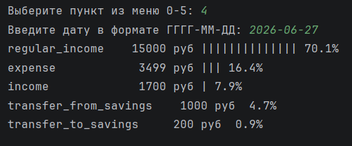

<div align="center">
<pre>
  Баланс (₽)
     ↑
 12k │                             ████████
 10k │                       ██████
  8k │                 ██████
  6k │           ██████
  4k │     ██████
  2k │██████
     └─────────────────────────────────────→ Время
        Янв  Фев  Мар  Апр  Май  Июн  Июл

  ◈ Транзакций: 1 247          ◈ Регулярных платежей: активны
  ◈ Сбережений: 34 500 ₽       ◈ Последняя операция: сегодня, 09:41
</pre>
</div>

<h1 align="center">Финансовый трекер — версия 2</h1>

<p align="center">
  <a href="https://www.python.org/"></a>
  <a href="./LICENSE"></a>
  <a href="#"></a>
</p>

---

## Обзор

Консольное приложение для комплексного управления личными финансами: учёт доходов и расходов, сбережения, регулярные платежи и ежемесячная аналитика.  
Вторая версия полностью переработана с применением объектно-ориентированного подхода и разделением хранилищ.

---

## Сравнение с первой версией

| Характеристика              | Версия 1 (монолит)                  | Версия 2 (текущая)                       |
|-----------------------------|-------------------------------------|------------------------------------------|
| Архитектура                 | Один файл, глобальные переменные    | ООП: `Record`, `BaseStorage`, трекеры    |
| Хранение данных             | Единый JSON-словарь                 | Три независимых JSON-файла               |
| Разделение логики           | Всё в одном скрипте                 | `models.py` + `personal_finance_tracker.py` |
| Повторные платежи           | Возможно дублирование               | Защита через поле `last_processed`       |
| Статистика                  | Примитивный подсчёт                 | Класс `Statistics` с процентами и шкалой |

---

## Структура проекта
finance_tracker_v2/
├── personal_finance_tracker.py # Точка входа и интерфейс командной строки
├── models.py # Бизнес-логика и хранилища
├── finance_transactions.json # Доходы / расходы
├── savings_transactions.json # Операции с накоплениями
├── regular_payments.json # Повторяющиеся платежи
├── .gitignore
└── README.md

---


## Возможности

### 1. Транзакции
- Добавление дохода или расхода с автоматической датой.
- Просмотр всех записей или фильтрация по интервалу дат.
- Удаление по уникальному идентификатору.

### 2. Сбережения
- Независимый баланс накоплений.
- Прямое пополнение, перевод с основного счёта и обратно.
- Детальная история операций.

### 3. Регулярные платежи
- Настройка шаблона: день месяца, сумма, описание, авто-подтверждение.
- При старте программы автоматически проверяется, требуется ли начисление за текущий день.
- Защита от повторного списания благодаря временной метке последней обработки.

### 4. Статистика
- Расчёт доходов и расходов за любой месяц (вводится в формате `ГГГГ-ММ`).
- Процентное распределение расходов по категориям.
- Визуальная шкала: `|` = 5% от общей суммы расходов.

### 5. Баланс
- Отображение текущего остатка основного счёта (без учёта сбережений).

### 6. Автосохранение
- Данные немедленно записываются в JSON-файлы после каждой операции.

---

## Требования

- Python 3.9 или выше.
- Только стандартная библиотека.

---

## Быстрый старт

```bash
git clone https://github.com/Dizabbar/finance_tracker_v2.git
cd finance_tracker_v2
python personal_finance_tracker.py
При первом запуске создаются пустые JSON-файлы для хранения данных.

Скриншоты
<p align="center">  <br/> <em>Главное меню программы (пример)</em> </p><p align="center">  <br/> <em>Визуализация статистики расходов за месяц</em> </p>
Рекомендация: замените изображения на собственные скриншоты, поместив их в папку assets/.

Планы на будущее
Миграция на SQLite / PostgreSQL – повышение надёжности и поддержка сложной аналитики.

REST API – возможность интеграции с мобильными и веб-приложениями.

Веб-интерфейс – простой фронтенд, работающий поверх API.

Экспорт отчётов – генерация CSV / PDF прямо из консоли.

Лицензия
Проект распространяется под лицензией MIT. Подробнее см. файл LICENSE.

<p align="center"> <br/> <strong>«Важно не то, сколько вы зарабатываете, а то, сколько у вас остаётся»</strong><br/> <sub>— Роберт Кийосаки</sub> </p><p align="center"> <br/> Разработка: <strong>Dizabbar</strong><br/> <a href="https://github.com/Dizabbar">GitHub</a> </p>
<p align="center"> <sub>© 2026 — finance_tracker_v2</sub> </p> ```
